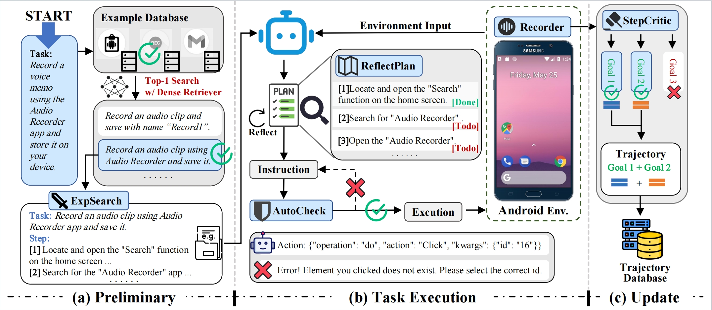

# AndroidGen: Building an Android Language Agent under Data Scarcity

---
<p align="center">📃 <a href="https://arxiv.org/abs/2504.19298" target="_blank">Paper</a> • 🌐 <a href="https://androidgen-acl.github.io/" target="_blank">Website</a> </p>

## Table of Contents
- [AndroidGen: Building an Android Language Agent under Data Scarcity](#androidgen-building-an-android-language-agent-under-data-scarcity)
  - [Table of Contents](#table-of-contents)
- [Overview](#overview)
  - [Features](#features)
- [Preparation](#preparation)
  - [Prepare Code and Environments](#prepare-code-and-environments)
  - [\[Optional\] Prepare Retriever Checkpoint](#optional-prepare-retriever-checkpoint)
  - [Prepare Agent LLM](#prepare-agent-llm)
    - [OpenAI Model](#openai-model)
    - [Trained GLM / Llama](#trained-glm--llama)
- [Usage](#usage)
  - [Export Environment Variables](#export-environment-variables)
  - [Launch the Android Emulator from the command line](#launch-the-android-emulator-from-the-command-line)
  - [Configuration](#configuration)
  - [Run AndroidGen](#run-androidgen)
  - [\[Optional\] Prepare database](#optional-prepare-database)
- [Evaluation](#evaluation)
- [License](#license)

---
# Overview



Overview: AndroidGen framework is designed to complete tasks in Android. Our process comprises
three stages: preliminary, task execution, and update. Preliminary (a): ExpSearch retrieve the top-1 similar tasks and
trajectories from the database and input them into the agent. Task Execution (b): ReflectPlan assesses the progress
and updates the plan. Then, the agent generates operations based on the environment, plan, and retrieval example.
AutoCheck verifies these operations, executing them if successful or regenerating them if not. Update (c): StepCritic
evaluates the trajectories in fine-grand and updates the database accordingly.

## Features

-   **ExpSearch**: ExpSearch is a novel approach leveraging LLM’s in-context learning ability to optimize the agent iteratively by learning from its own trajectories.
-   **ReflectPlan**: We develop ReflectPlan that enables self-assessment of the progress of tasks during execution. This approach empowers the agent to enhance
planning and reflecting capabilities
-   **AutoCheck**: We develop AutoCheck module to enhance agent robustness. Upon generating the operation, AutoCheck proactively verifies the response's validity. When detecting potential issues or non-compliant actions, the subsequent execution is terminated, and feedback is provided to the agent in the next round.
-   **StepCritic**: StepCritic can decompose tasks into various 
sub-goals, and evaluate the trajectory step-by-step. This approach enables a granular assessment of the trajectories, maximizing the data’s learning value. 

---
# Preparation

## Prepare Code and Environments

1. **Install the required dependencies:**
```bash
pip install -r requirements.txt
```

2. **Install AndroidWorld:**
```bash
git clone https://github.com/google-research/android_world
```
You need to download Android Studio and configure it according to the guidance of [AndroidWorld](https://github.com/google-research/android_world).
   
## [Optional] Prepare Retriever Checkpoint
If you want to enable the ExpSearch function, you should download the retriever checkpoint and specify the path.

You need to download [Contriever](https://huggingface.co/facebook/contriever-msmarco)

Then change the "retriever_ckpt_path" in config.json to your path.

## Prepare Agent LLM
You can use OpenAI or our trained models as your Android agent.

### OpenAI Model
You need to export your `OPENAI_TOKEN` for usage.

```bash
export OPENAI_TOKEN = "YOUR KEY"
```

### Trained GLM / Llama
Download our trained GLM [here](https://huggingface.co/THUDM/androidgen-glm-4-9b) and Llama [here](https://huggingface.co/THUDM/androidgen-llama-3-70b), then deploy the checkpoint with [vLLM](https://github.com/vllm-project/vllm)

---

# Usage

## Export Environment Variables

```bash
export PYTHONPATH="Path to your androidworld:$PYTHONPATH"
```
## Launch the Android Emulator from the command line

```bash
EMULATOR_NAME=AndroidWorldAVD
~/Library/Android/sdk/emulator/emulator -avd $EMULATOR_NAME -no-snapshot -grpc 8554
```

## Configuration

- **llm**: Settings related to the language model.
  - `model_name`: Name of the model to use. Example: `"gpt-4o-2024-08-06"`
  - `model_type`: Type of the model. Example: `"text"`

- **architecture**: Settings related to the autonomous reasoning module.
  - `reflectplan`: Configuration for the planning module.
    - `model_name`: Name of the model for planning. Example: `"gpt-4o-2024-08-06"`
    - `model_type`: Type of the model for planning. Example: `"text"`
  - `autocheck`: Boolean flag for automatic checking. Example: `true`
  - `expsearch`: Configuration for example retrieval.
    - `retriever_ckpt_path`: Path to the retriever checkpoint.
    - `database_path`: Path to the example database.

- **trace_dir**: Directory for storing trace files. Example: `"./episodes"`

## Run AndroidGen

To run AndroidGen, just type the following command in your terminal, and it will start working:

```bash
python run.py
```

After running, you will get the complete trajectory of the task in `trace_dir`

## [Optional] Prepare database

After obtaining task trajectories from the previous runs, you can run `judge.py` to build your own database for ExpSearch.

```bash
python -m model.judge.judge \
    --data_dir=./episodes \
    --output_path=./database.json
```

# Evaluation
To run the AndroidWorld evaluation, you can run the following command:

```bash
cd evaluate/androidworld
python eval.py \
  --suite_family=android_world \
  --agent_name=androidgen
```

For the evaluation of popular applications and AitW, we provide the datasets under `/evaluate` (the AitW test set is taken from [DigiRL](https://github.com/DigiRL-agent/digirl/tree/master)).

# License

This repository is licensed under the [Apache-2.0 License](LICENSE). All open-sourced data is for resarch purpose only.
